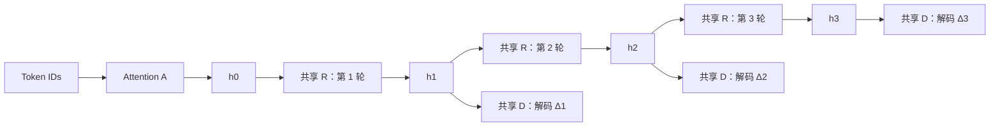

# ReCal-LM

ReCal-LM 研究共享语言循环体 R、独立 Attention A、Decoder D 和 Drift 预测之间的协作。当前在单张 NVIDIA H20 上训练 **R 核心约 3B 参数**的语言模型；四模块总参数为 **3,704,295,168**，当前可训练参数为 **3,605,991,168**。这里的 3B 指 R 的参数规模，不是已经训练了 3B tokens。

## 当前状态：V3-E1 warm-start

**2026-09-17：从 A-final 开启独立训练阶段，继承模型权重，重新初始化 AdamW 和学习率调度。** 旧 `four-model-r3b-10b` 策略已停止；目前只运行约 3M tokens 的 E1，尚未进入 E2/E3，也未恢复 10B 主计划。

本次发布的固定快照为 **2026-09-17 13:53:22 UTC**：E1 已完成 **156 / 732 步、638,976 tokens**，仍在 warmup；该时点尚无本轮训练后的验证结果。后台训练会继续，GitHub 中的快照不会自动刷新。

- [V3 架构、训练策略与阶段门槛](docs/v3-training.md)
- [真实训练环境、数据与实验结果](docs/training-results.md)
- [代码变更与验证](docs/code-changes.md)
- [可核对的 JSON/CSV 指标快照](docs/evidence/2026-09-17/README.md)
- [早期 Router/Teacher 原型文档](docs/legacy-prototype.md)与[长期多模态设计](项目设计/Modular_Recurrent_Cognitive_Architecture.md)

## 当前实际计算路径



同一序列内所有 token 同步经过 R1/R2/R3。每轮 Decoder 接收 `Δk = hk − h(k−1)`，而非绝对状态 `hk`。图中的三次 R 与三次 D 分别复用参数。

E1 的目标为：

```text
L = (CE1 + CE2 + CE3) / 3 + 0.05 × L_drift
alpha = lambda_A = lambda_R = lambda_monotonic = 0
```

旧实现已有 `[0.2, 0.4, 1.0]` 的多深度文本监督；E1 将其改为等权平均，并关闭辅助对齐与强制单调约束。它既改变层间比例，也改变文本 loss 的总系数；不是从“只有 CE3”首次引入中间层监督。

## 实验推动的路线调整

| 实际执行路径 | Fixed CE | Extra CE |
|---|---:|---:|
| A-final，固定 R1 | 6.8577 | 6.9822 |
| A-final，固定 R2 | 6.8632 | 6.9619 |
| A-final，固定 R3 | 6.8722 | 6.9632 |
| V2 confidence，真实混合深度 | 7.1090 | 7.2733 |
| 上一轮 E1，固定 R3 | 6.8368 | 6.9281 |

V1/V2 的真实 token 异步路径未通过实验门槛，因此当前停止 per-token STOP/CONTINUE 和 R4–R8 扩展。Cached Oracle 读取真实目标后选择深度，只作离线分析。

上一轮 E1 虽然改善 CE，但 Extra 的深度 CE 范围扩大，Fixed 的状态方差比低于保留门槛，因此没有进入 E2。本轮从 A 重新开始，以较低学习率和新 warmup 验证，不使用上一轮失败 E1 的权重。以上数据来自有限的 Fixed/Extra 验证集，不代表通用能力评测。

## 本轮训练配置

| 项目 | 实际设置 |
|---|---|
| 来源 | A-final，global step 34,243；累计 140,259,328 tokens |
| 优化器 | 新 AdamW，betas=(0.9, 0.95)，weight_decay=0.1 |
| 学习率 | 300 步线性 warmup 到 5e-5，之后恒定 |
| 预算 | 732 步 × 4,096 tokens = 2,998,272 tokens |
| 输入 | batch=1，seq_len=512，grad_accum=8 |
| 精度 | BF16 autocast，FP32 参数，梯度检查点 |
| 验证 | 起点及约 1M / 2M / 3M tokens；Fixed 8 批、Extra 24 批 |
| 深度 | 同步 K=3；本轮不启用 Residual Gate / Anchor branch / Refresh Head |

后续 E2 才考虑以 `h + g × (R_old(h) − h)` 加 gate，初始 `g=1`；E3 才考虑 block 级 Attention Refresh。相关实验代码已有，但尚未通过本轮实模型训练验证。

## 代码入口与验证

当前实现位于 `recal/model/text_state_model.py`、`recal/evaluation/synchronous_v3.py`；本轮入口为 `scripts/run_v3_e1_warmstart.py`，监督进程为 `scripts/supervise_v3_e1_warmstart.py`。

训练脚本保留了本机实验路径和固定日期目录，需要本地 A checkpoint、tokenizer、数据 manifest、验证集及 `plan.json`。仓库不含这些大型运行产物；重新部署前须调整路径并创建新的输出目录，不能直接将旧 launcher 当通用一键训练入口。

只运行小模型 CPU 测试：

```bash
python -m pip install -e . pytest
OMP_NUM_THREADS=4 python -m pytest -q
```

实际 Parquet 训练还需要 `pyarrow`。已验证环境与测试结果见[代码变更说明](docs/code-changes.md)。早期小模型演示命令保留在[历史文档](docs/legacy-prototype.md)。

## 模型与数据保留

保留旧主线最终 step 33,291 和只读 A-final。本轮只在 E1 通过时保留终点用于 E2；失败则保留训练状态与实验记录，不保存失败模型。不保存 Adam 状态，不能声称中断后精确续训。

训练启动后已清理 18 份旧模型文件及备份中的 4 份重复模型，回收约 **77.08 GB**。原始训练数据、验证数据、指标、历史源码和复现元数据保留在本地；仓库提供源码和选定的指标快照。

## License

[MIT](LICENSE)
